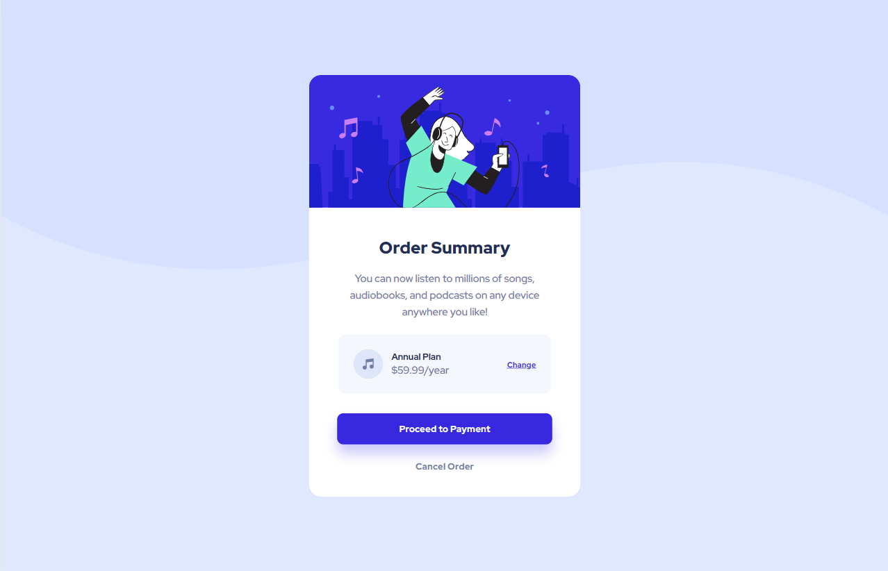

# Frontend Mentor - Order summary card solution

This is a solution to the [Order summary card challenge on Frontend Mentor](https://www.frontendmentor.io/challenges/order-summary-component-QlPmajDUj).

Frontend Mentor challenges help you improve your coding skills by building realistic projects.

## Table of contents

- [Frontend Mentor - Order summary card solution](#frontend-mentor---order-summary-card-solution)
  - [Table of contents](#table-of-contents)
  - [Overview](#overview)
    - [The challenge](#the-challenge)
    - [Screenshot](#screenshot)
    - [Links](#links)
  - [My Process](#my-process)
    - [Built With](#built-with)
    - [What I Learned](#what-i-learned)
  - [Author](#author)

## Overview

### The challenge

Users should be able to:

- See hover states for interactive elements

### Screenshot

Desktop:

Mobile:

### Links

- [Live Demo](https://wess-mhhw.github.io/order-summary-component/)

## My Process

### Built With

- Mobile-first workflow
- Semantic HTML5 markup
- CSS custom properties
- Flexbox

### What I Learned

This project provided an excellent opportunity to apply my knowledge of HTML5 and CSS3, with a focus on using flexbox for layout. It challenged me to maintain high code cleanliness standards and overcome responsiveness issues. Through persistence, I successfully achieved the desired result.

## Author

- Frontend Mentor - [@wess-MHHW](https://www.frontendmentor.io/profile/wess-MHHW)
- LeetCode - [@wess-MHHW](https://leetcode.com/wess-MHHW/)
- Linkedin - [@wassim-maaoui](https://www.linkedin.com/in/wassim-maaoui/)
